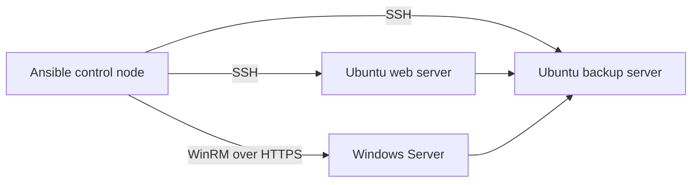

# Ansible Hybrid Homelab

A portfolio lab that demonstrates repeatable administration of Linux and Windows hosts with Ansible. The project applies a secure baseline, manages local support accounts, checks core services, configures scheduled backups, and produces a simple health report.

> This is a demonstration environment built with sample hosts and placeholder credentials. It contains no client systems, production data, or secrets.

## What this demonstrates

- Infrastructure as code with reusable Ansible roles
- Linux administration through SSH
- Windows administration through WinRM
- User, package, service, firewall, and update management
- Idempotent configuration and safe dry runs
- Backup scheduling and operational health checks
- Secret handling with Ansible Vault
- Automated linting with GitHub Actions

## Lab architecture



The inventory uses documentation-only IP addresses. Replace them with addresses from your own isolated lab before running anything.

## Repository structure

```text
.
├── .github/workflows/lint.yml
├── ansible.cfg
├── inventories/lab
│   ├── group_vars
│   │   ├── all.yml
│   │   ├── linux.yml
│   │   └── windows.yml
│   └── hosts.yml
├── playbooks
│   ├── backup.yml
│   ├── health_check.yml
│   └── site.yml
├── roles
│   ├── linux_baseline
│   └── windows_baseline
└── requirements.yml
```

## Prerequisites

- Ansible Core 2.16 or later on Linux, macOS, or WSL
- Python 3.10 or later
- SSH access to Linux targets
- WinRM configured on Windows targets
- Ansible Vault for passwords and other secrets

Install the required collections:

```bash
ansible-galaxy collection install -r requirements.yml
```

## Configure the lab

1. Copy the example vault file and encrypt it:

   ```bash
   cp inventories/lab/group_vars/vault.example.yml inventories/lab/group_vars/vault.yml
   ansible-vault encrypt inventories/lab/group_vars/vault.yml
   ```

2. Replace the sample IP addresses in `inventories/lab/hosts.yml`.
3. Update usernames and service choices in `inventories/lab/group_vars/`.
4. Confirm connectivity without changing hosts:

   ```bash
   ansible all -m ping --ask-vault-pass
   ansible windows -m ansible.windows.win_ping --ask-vault-pass
   ```

## Run the automation

Preview changes first:

```bash
ansible-playbook playbooks/site.yml --check --diff --ask-vault-pass
```

Apply the baseline:

```bash
ansible-playbook playbooks/site.yml --ask-vault-pass
```

Configure scheduled backups or create a health report:

```bash
ansible-playbook playbooks/backup.yml --ask-vault-pass
ansible-playbook playbooks/health_check.yml --ask-vault-pass
```

Health reports are written to `artifacts/` on the control node. The directory is excluded from version control because reports can contain host details.

## Security decisions

- Passwords are referenced through Vault variables and never committed.
- WinRM defaults to HTTPS and certificate validation.
- Firewall rules allow only the services defined for each host group.
- Linux administration uses a dedicated support group with sudo access.
- Backups use timestamped archives and a configurable retention period.

## Validation

The GitHub Actions workflow runs YAML linting and Ansible linting for every push and pull request. Locally, run:

```bash
yamllint .
ansible-lint playbooks/*.yml
```

## Suggested next improvements

- Add Molecule tests for the Linux role
- Add a Windows domain controller and domain-joined workstation
- Export health data to Grafana or an n8n notification workflow
- Add encrypted off-site backup storage

